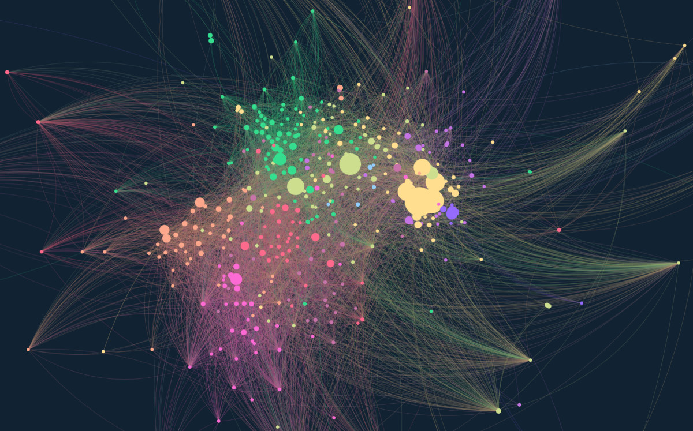

# Pulpit
### Political undercurrents: linkage, propagation, influence on Telegram

Telegram is home to thousands of political channels — news outlets, activist groups, propaganda outlets, and everything in between. They constantly reference each other: forwarding messages, linking to one another, amplifying certain voices and ignoring others. These cross-references are not random; they reveal alliances, ideological clusters, and influence networks that are otherwise invisible.

**Pulpit** makes those networks visible. It collects messages from a set of Telegram channels you define, traces every forward and every `t.me/` link between them, and turns the result into an interactive map you can explore in a browser — zooming in on individual channels, filtering by community, comparing the reach of different nodes.

It is designed for journalists, researchers, and analysts working on political communication, disinformation, and online influence. Pulpit is actively developed and evolving — see the [changelog](CHANGELOG.md) for what is new.

---

### Under the hood

Pulpit is built around three stages:

**1. Crawling.** Pulpit uses the official Telegram API (via [Telethon](https://github.com/LonamiWebs/Telethon)) to download messages from the channels you select. For each message it records forwards (which channel's content was reposted) and inline `t.me/` references (links to other channels appearing in the message text or as URL entities). This produces a directed, weighted graph: an edge from channel A to channel B means A regularly amplifies B's content, and its weight reflects how often, relative to A's total output.

**2. Analysis.** The graph is analysed with [NetworkX](https://networkx.org/). Several centrality measures can be computed — PageRank, HITS Hub and Authority scores, betweenness centrality, in-degree centrality, out-degree centrality, harmonic centrality, Katz centrality, bridging centrality, Burt's constraint, content originality, and amplification — to rank channels by influence, reach, or structural importance. Community detection algorithms (Louvain, Leiden, k-shell decomposition, Infomap, or your own manually defined groups) identify clusters of channels that behave as coherent ecosystems.

**3. Visualisation.** The graph is laid out using [ForceAtlas2](https://github.com/bhargavchippada/forceatlas2), a force-directed algorithm that naturally pulls tightly connected clusters together. The result is exported as a self-contained HTML file powered by [Sigma.js](http://sigmajs.org/), with controls for searching, filtering by community, changing node size by any computed measure, and inspecting individual channels.

---

<figure>



<figcaption>Example output — ~400 nodes, ~8 000 edges, Louvain community detection, vapoRwave palette.</figcaption>
</figure>

## How it works

1. You provide search terms; Pulpit finds matching Telegram channels via the API.
2. You review the results in the admin interface and group channels into **Organizations** — thematic clusters (e.g. by political leaning, country, topic).
3. Pulpit crawls the selected channels, collecting messages and resolving cross-channel references (forwards and `t.me/` links).
4. A graph is built from those references, communities are detected and colored, a ForceAtlas2 layout is applied, and the result is exported as an interactive HTML map.


## Analysis

See [ANALYSIS.md](ANALYSIS.md) for a detailed explanation of all network measures and community detection strategies, with examples drawn from political Telegram networks.


## Installation

See [INSTALLATION.md](INSTALLATION.md) for requirements, setup steps, and database initialisation.


## Workflow

> On some systems replace `python` with `python3` or `py`.

### 1. Start the admin interface

```sh
python manage.py runserver
```

Open [http://localhost:8000/admin/](http://localhost:8000/admin/).

### 2. Add search terms

In the admin, go to **Search Terms** and add keywords. These are used to discover channels by name.

### 3. Discover channels

```sh
python manage.py search_channels           # process all pending search terms
python manage.py search_channels --amount 15  # process at most 15 terms
```

Processes pending search terms (ordered by oldest check first) and saves the matching channels to the database. Use `--amount` to cap the number of terms processed in one run.

### 4. Organise channels

Back in the admin, open **Channels** and assign each channel you want to analyse to an **Organization**. Mark the organization as `is_interesting = True`. Channels without an interesting organization are ignored during crawling and graph export.

### 5. Crawl channels

```sh
python manage.py get_channels
```

Downloads messages for all interesting channels. Re-run at any time to fetch new messages.

To also fill gaps in message history (messages that were deleted or missed on a previous run):

```sh
python manage.py get_channels --fixholes
```

To crawl only channels whose database id is less than or equal to a given value (useful to resume or target a specific subset):

```sh
python manage.py get_channels --fromid 42
```

To refresh view counts, forward counts, and pinned status (these counters change over time but are only recorded when a message is first crawled):

```sh
python manage.py get_channels --refresh-messages-stats               # refresh all messages
python manage.py get_channels --refresh-messages-stats 200           # refresh only the 200 most recent per channel
python manage.py get_channels --refresh-messages-stats 2024-01-01    # refresh all messages from that date to present
```

### 6. Export the graph

```sh
python manage.py export_network
```

Builds the graph, applies community detection and layout, and writes the result to `graph/`.
By default also writes three sortable HTML tables:

- `graph/channel_table.html` — one row per channel with all computed measures
- `graph/network_table.html` — whole-network structural metrics (density, reciprocity, clustering, path length, WCC/SCC fractions, directed assortativity, Freeman centralization, modularity per strategy) plus an interactive scatter plot for comparing any two measures on log-log axes
- `graph/community_table.html` — one table per community detection strategy with structural metrics per community (node count, internal/external edges, density, reciprocity, average clustering coefficient, average shortest path length, diameter)

All HTML outputs load their data at page load time from `graph/data/*.json`; they are static files that work from any HTTP server.

To control the tabular output format:

```sh
python manage.py export_network --table-format xlsx       # Excel only
python manage.py export_network --table-format html+xlsx  # both HTML and Excel
python manage.py export_network --table-format none       # no tabular output
```

The Excel output produces `graph/channel_table.xlsx` (one row per channel), `graph/network_table.xlsx` (whole-network metrics on a single sheet), and `graph/community_table.xlsx` (one sheet per community detection strategy).

To restrict the graph to a date range (channels with no messages in the period are excluded):

```sh
python manage.py export_network --startdate 2023-01-01                            # messages from this date
python manage.py export_network --enddate 2023-12-31                              # messages up to this date
python manage.py export_network --startdate 2023-01-01 --enddate 2023-12-31       # date range
```

To make the output discoverable by search engines (sets `index, follow` robots tags and writes a permissive `robots.txt`; without this flag the output actively discourages indexing):

```sh
python manage.py export_network --seo
```

To also generate a 3D graph alongside the 2D one:
```sh
python manage.py export_network --3d
```

This produces `graph/graph3d.html`, a Three.js scene where you can rotate, zoom, and pan the graph and click nodes to inspect connections. ForceAtlas2 runs in 3D using the vectorised O(n²) back-end, so it is slower on large graphs.

To skip graph generation (tables and `index.html` are still produced):
```sh
python manage.py export_network --nograph
```

To compare this network against another export side-by-side:
```sh
python manage.py export_network --compare /path/to/other/graph/data
```

`DATA_DIR` must be a `data/` directory produced by a previous `export_network` run (it contains `network_metrics.json` and `channels.json`). The command copies it to `graph/data_compare/` and generates `graph/network_compare_table.html` with:

- a 3-column whole-network metrics table (Metric / This network / Compare network)
- a modularity-by-strategy comparison table
- interactive scatter plots with this network's nodes in blue and the compare network's nodes in red; axes are user-selectable, log scale, zoom/pan enabled

### 7. View the graph

```sh
cd graph
python -m http.server 8001
```

Open [http://localhost:8001/](http://localhost:8001/) in your browser. The landing page (`index.html`) links to the graph, tables, and downloads.


## Configuration

See [CONFIGURATION.md](CONFIGURATION.md) for the full list of options.
