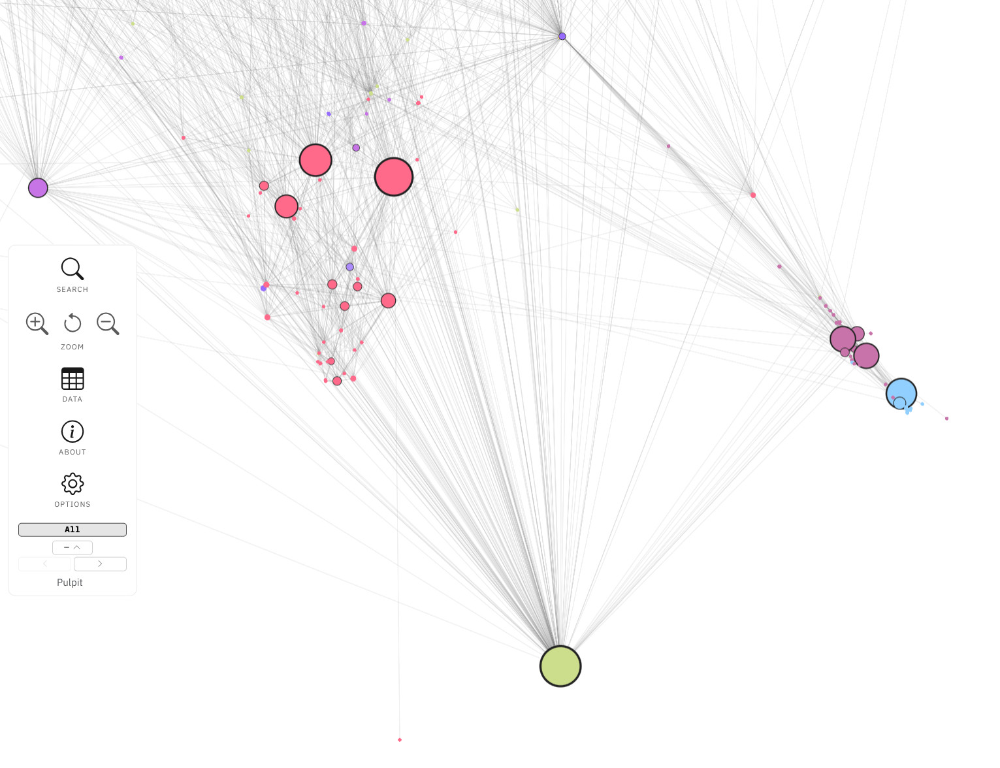
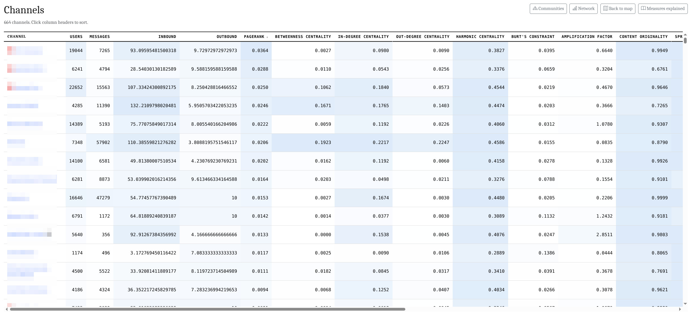
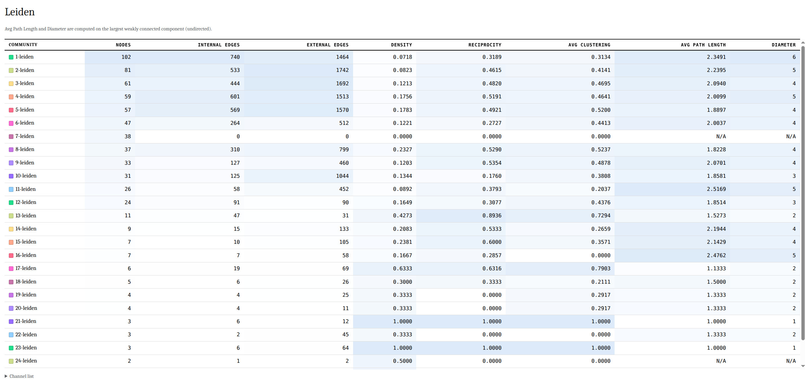
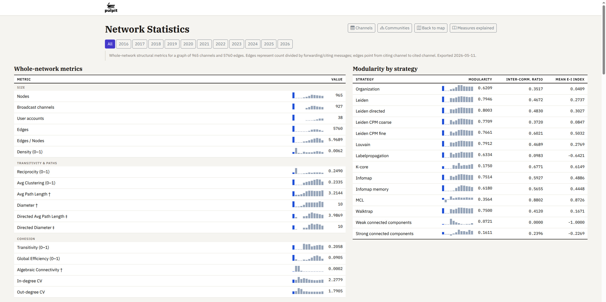
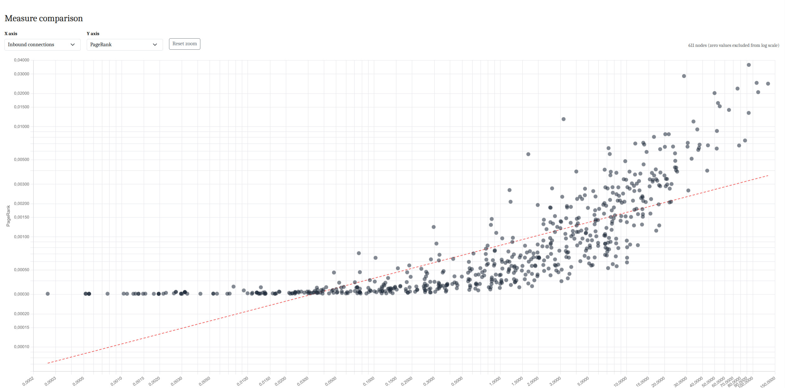
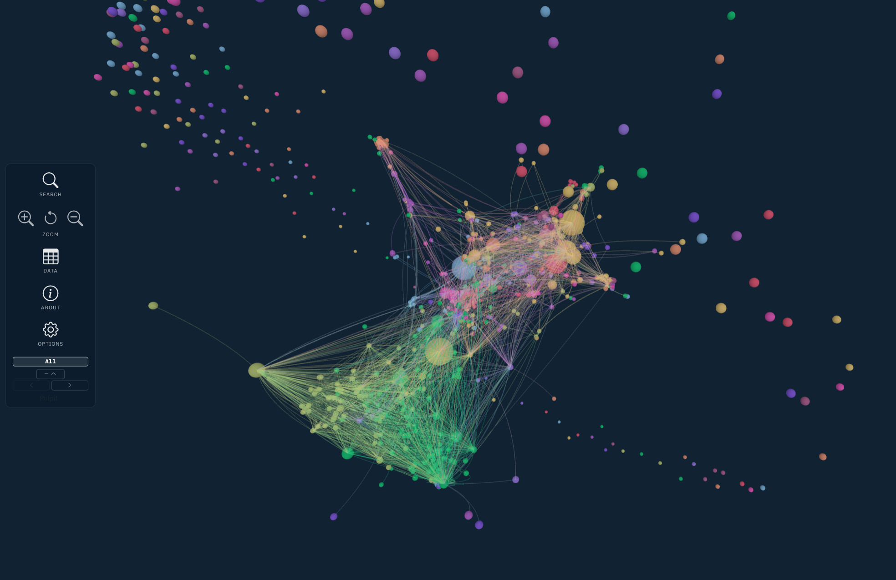
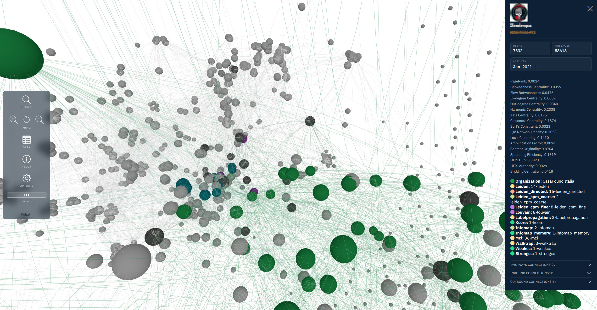
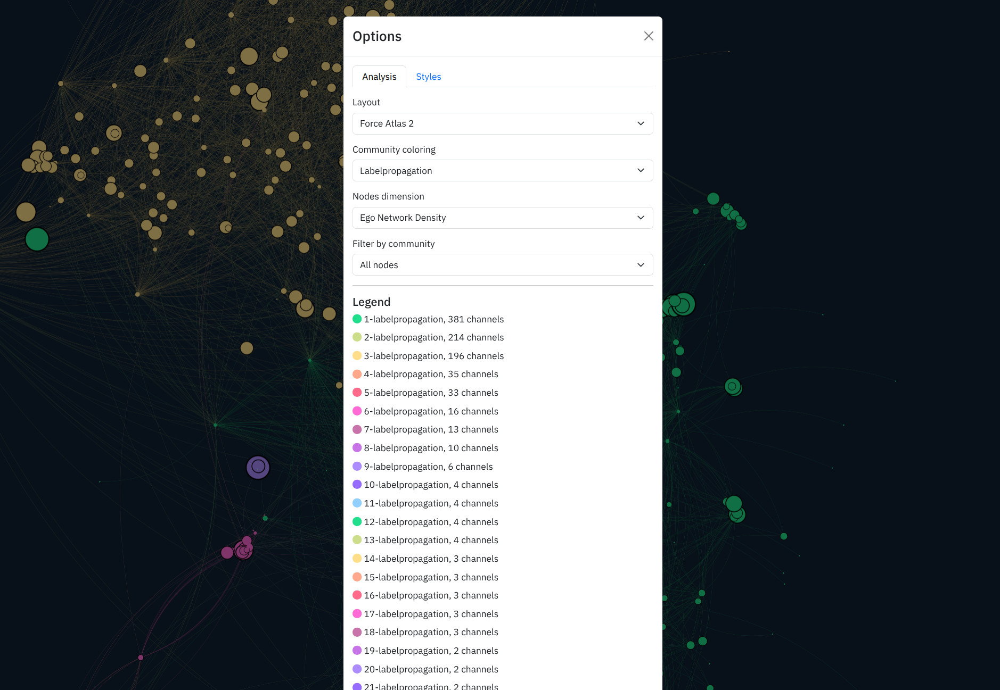

# Pulpit Screenshots

Visual samples of Pulpit output across different graph sizes, community detection strategies, and display modes.

## Example output, first graph
~600 nodes, ~10 000 edges, Leiden directed community detection, PageRank nodes dimension, vapoRwave palette

<figure>

<figcaption>Example output for 2D graph.</figcaption>
</figure>
 

<figure>

<figcaption>Example output for channels.</figcaption>
</figure>
 

<figure>

<figcaption>Example output for communities.</figcaption>
</figure>
 

<figure>

<figcaption>Example output for whole-network measures.</figcaption>
</figure>
 

<figure>

<figcaption>Example output for measure comparison.</figcaption>
</figure>
 

## Example output, second graph
~800 nodes, ~5 000 edges, Leiden directed community detection, Messages nodes dimension, vapoRwave palette

<figure>

<figcaption>Example output for 3D graph.</figcaption>
</figure>
 

<figure>

<figcaption>Example output for clicking a single node.</figcaption>
</figure>
 

<figure>

<figcaption>Example output for visualization options menu.</figcaption>
</figure>
 

← [README](README.md) · [Installation](INSTALLATION.md) · [Workflow](WORKFLOW.md) · [Configuration](CONFIGURATION.md) · [Analysis](ANALYSIS.md) · [Changelog](CHANGELOG.md)

